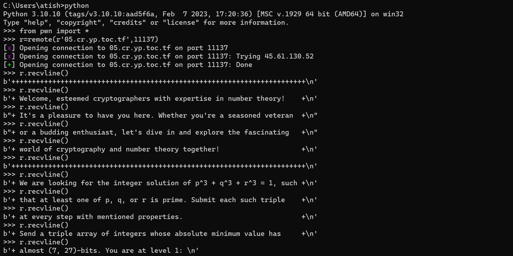

# TPSD

## Source

Solving Diophantine equations is a notoriously challenging problem in number theory, and finding non-trivial integer solutions for certain equations is considered a major open problem in mathematics.

## Exploit

There is no script provided, so we will manually interact with the challange to get the instructions using python and pwntools.

